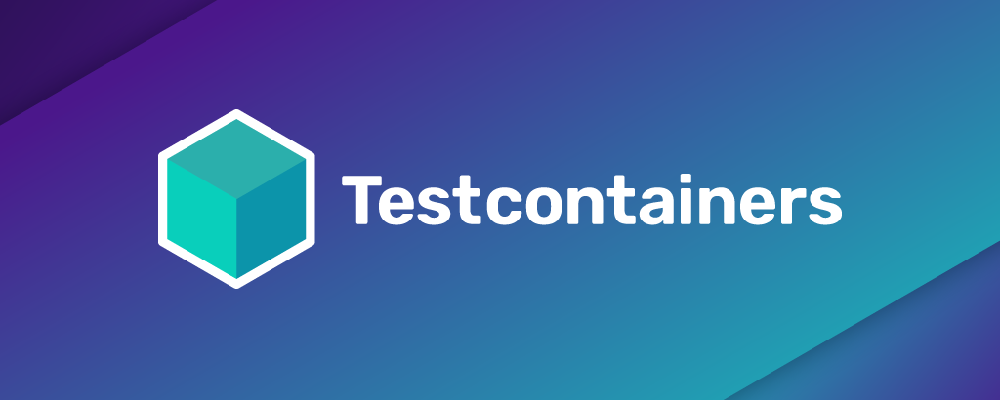

# Testcontainers

<!-- allow aspect ratio computation to reduce layout shift. CSS enforces max-width: 100% -->

<strong>Not using NodeJS? Here are other supported languages!</strong>

    <a href="https://testcontainers.org/" class="card-grid-item">Java</a>
    <a href="https://golang.testcontainers.org/" class="card-grid-item">Go</a>
    <a href="https://dotnet.testcontainers.org/" class="card-grid-item">.NET</a>
    <a href="https://testcontainers-python.readthedocs.io/en/latest/" class="card-grid-item">Python</a>
    <a class="card-grid-item">Node.js</a>
    <a href="https://docs.rs/testcontainers/latest/testcontainers/" class="card-grid-item">Rust</a>

## About

Testcontainers is a library that supports tests, providing lightweight, throwaway instances of common databases, Selenium web browsers, or anything else that can run in a Docker container.

## License

See [LICENSE](https://raw.githubusercontent.com/testcontainers/testcontainers-node/master/LICENSE).

## Copyright

Copyright (c) 2018 - 2023 Cristian Greco and other authors.

See [contributors](https://github.com/testcontainers/testcontainers-node/graphs/contributors/) for contributors.

---

Join our [Slack workspace](https://slack.testcontainers.org/) | [Testcontainers OSS](https://www.testcontainers.org/) | [Testcontainers Cloud](https://www.testcontainers.cloud/)